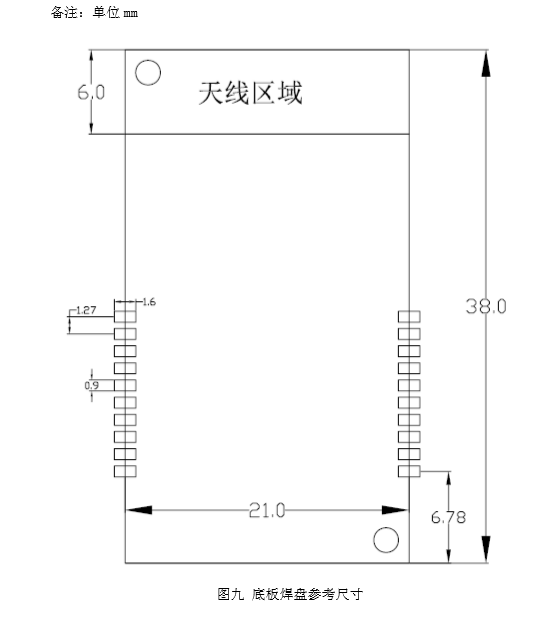

# WIFI-模组接入

模组接入方式适合于不具备通讯能力的产品，需要将小米智能模组嵌入现有产品的电路中。

## WIFI模组硬件简介

小米MHCW03P模组开发板外观：


管脚图：


原理图：


- LOG输出口(74880 8N1)，你可以通过这个口看到模组的工作状态

- 一个典型的LOG输出，包含固件版本 *firmware*， 设备DID *digital_did*， MAC地址*mac address*

```
_|      _|  _|_|_|  _|_|_|    _|_|  
_|_|  _|_|    _|      _|    _|    _|
_|  _|  _|    _|      _|    _|    _|
_|      _|    _|      _|    _|    _|
_|      _|  _|_|_|  _|_|_|    _|_|  
OTP read OK
JENKINS BUILD NUMBER: N/A
BUILD TIME: N/A
BUILT BY: N/A
firmware: 1.2.5
MIIO APP VER: N/A
MIIO MCU VER: N/A
ESP SDK VER: 1.3.0(2ecfb74)
digital_did is 12593364
mac address is f0b42905b742
```


## 设备固件研发

- 你只需要通过串口(115200 8N1)即可与小米模组进行通信，如图：


- 通过SecureCRT工具打开串口，输入help既可以得到支持的串口命令列表。


## 常用的串口命令

### props

- 属性上报
- 参数：<prop_name_1> <value_1> <prop_name_2> <value_2> ...
- 返回：ok 或 error
- 说明：参数至少要有一个名值对。
- 举例：

```
↑props temp 21 hum 50 location "home" 
↓ok 
↑props location office (格式非法)
↓error
```

- 限制：属性名的字符个数不得多于31个（可等于31）

### event

- 事件上报
- 参数：<event_name> <value_1> <value_2> ...
- 返回：ok 或 error
- 说明：发送上行事件。
- 举例：

```
↑event overheat 170 
↓ok 
↑event button_pressed 
↓ok 
↑event fault "motor stuck" "sensor error"
↓ok 
↑event fault motor stuck (格式非法) 
↓error 
↑event fault "motor stuck" 
↓ok ... (短时间内大量event） 
↑event fault "motor stuck" （此时，事件队列已满） 
↓error
```

- 限制：

1. 事件名的字符个数不得多于31个（可等于31）
2. 如果MIIO芯片断网，事件会在芯片里缓存最长10分钟，如果这段时间内网络未恢复正常，则事件会被丢弃
3. MIIO芯片最多缓存8条事件，如果短时间内大量调用event命令，则会造成缓存列表填满，后续事件会被丢弃

### get_down

- 循环获取wifi芯片透传的指令。此命令应该在主循环内循环调用，建议80~200ms间隔。
- 参数：无
- 返回：down <method_name> <arg1>,<arg2>,<arg3> ...
- 说明：获取下行指令。如果有下行方法，则返回该方法，如没有，则返回none。如果对上一个方法还没有给出结果，则返回error。MCU在获得下行方法后，有1s时间处理，并用result/error命令上传结果。超过1s后，则wifi模块认为调用失败。
- 返回值说明：如果没有下行命令，则返回down none 如果有下行命令，则返回命令名、命令参数（如果有参数）。命令名和参数之间用空格隔开，多个参数之间用逗号隔开。参数可以是双引号括起的字符串，或是数字。
- 举例：

```
↑get_down 
↓down none
↑get_down 
↓down power_on "light_on",60,0,1 
↑result "ok" 
↓ok 
↑get_down 
↓down power_off 
↑get_down 
↓error
```

- 你需要实现一个 down get_prop 方法，这样云端或者APP就可以实时查询你设备的属性状态，通常在刷新APP界面的时候很有用。

### result

- 参数：<value1> <value2> ...
- 返回：成功返回ok，失败返回error
- 说明：发送下行指令的执行结果，如果有多个返回值，则以空格分开。发送成功后，返回ok。
- 举例：

```
↑result 123 "abc" 
↓ok
```

### json_get_down

- 参数：无
- 返回：down <json_string>
- 说明：获取Json格式的下行指令。如果有下行方法，则返回该方法，如没有，则返回none。如果对上一个方法还没有给出结果，则返回error。MCU在获得下行方法后，有1s时间处理，并用result/error命令上传结果。超过1s后，则wifi模块认为调用失败。
- 返回值说明：如果没有下行命令，则返回down none。
举例：

```
↑json_get_down 
↓down none 
↑json_get_down 
↓down {“method":"power_on","params":["light_on",60,0,1],"id":123456} 
↑json_ack {"result":"ok"} 
↓ok
```

### json_ack

- 参数：<json_string>
- 返回：成功返回ok，失败返回error
- 说明：json_ack 与json_get_down相对应，用来回复下行指令执行的结果。
- 举例：

```
↑json_ack {"id":1,"error":{"code":-3,"message":"device timeout"}} 
↓ok 
↑json_ack {"id":1,"result":1} 
↓ok
```
### json_send

- 参数：<json_string>
- 返回：ok
- 说明：用来以json格式发出上行消息。
- 举例：

```
↑json_send {"method":"props","params":{"prop1":100,"prop2":"string"},"id":123} 
↓ok
```

### log

- 参数：<log_name> <arg1> <arg2> <arg3> ...
- 返回：ok
- 说明：用于上报以记录为目的的数据
- 举例：

```
↑log pure_water_record "2015-5-14 19:27:31" 210 33 500 
↓ok
```

### version

- 参数：无
- 返回：版本号，当前为2
- 说明：串口协议（本协议）的版本
- 举例：

```
↑version 
↓2
```

### net

- 参数：无
- 返回：unprov 或 offline 或 local 或 cloud 或 updating 或 uap
- 说明：询问网络状态。返回值分别代表：未配置、连接中（或掉线）、连上路由器但未连上服务器、连上小米云服务器、固件升级中、uap模式等待连接
- 举例：

```
↑net 
↓offline 
↑net 
↓local 
↑net 
↓cloud
```

### time

- 参数：无 或 posix
- 返回：当前日期和时间，格式见举例。时间为UTC+8时间，即中国的时间。
- 举例：

```
↑time 
↓2015-06-04 16:58:07 
↑time posix 
↓1434446397
```

### model

- 参数：无 或 <model_name_string>
- 返回：无参数时，返回当前model字符串。带参数时，将芯片model设为参数字符串，并返回ok。如果参数字符串不合法，则返回error。
- 说明：合法的model字符串有3部分构成：公司名、产品类别名、产品版本。3部分以“.”连接，总长度最多为22个字符。
- 举例：

```
↑model 
↓xiaomi.dev.v1 
↑model xiaomi.prod.v2
↓ok 
↑model 
↓xiaomi.prod.v2 
↑model company.product_name_that_is_too_long.v2 
↓error 
↑model plug 
↓error
```

### mcu_version

- 参数：<mcu_version_string>
- 返回：如果参数合法，则返回ok，非法则返回error
- 说明：上报MCU固件版本。要求必须是4位数字。MCU应该在应用固件引导后，第一时间调用该命令上报版本。另外，如果下行命令收到MIIO_mcu_version_req，也应该立即上报版本。
- 举例：

```
↑mcu_version 0001 
↓ok 
↑mcu_version A001 
↓error 
↑mcu_version 1
↓error
```

## reboot

- 参数：无
- 返回：ok
- 说明：MIIO接收到该命令后，将在0.5秒内重启。
- 举例：

```
↑reboot
↓ok
```

### restore

- 参数：无
- 返回：ok
- 说明：MIIO接收到该命令后，将清除wifi配置信息，并在0.5秒内重启。
- 举例：

```
↑restore 
↓ok
```

### factory

- 参数：无
- 返回：ok
- 说明：MIIO芯片收到该命令后，在0.5秒内重启，并进入厂测模式。该模式下，芯片会按照预设置信息连接路由器。预设路由器SSID：miio_default，密码：0x82562647
- 举例：

```
↑factory 
↓ok
```

### echo

- 参数：on 或 off
- 返回：ok
- 说明：打开串口回显功能。该功能开启时，MIIO芯片的串口输出会对输入进行回显。这在使用串口工具（比如SecureCRT或Xshell）时，提供方便。

### help

- 参数：无
- 返回：所有支持的命令和参数格式

### 保留的下行命令

MIIO芯片保留了一些命令名，用来通知主控MCU特定的事件。这类命令同样可用get_down得到，但无需result或error回复结果。

### MIIO_net_change

- 表示MIIO芯片的网络连接状态发生了变化。其后的参数代表了芯片最新的网络状态。网络状态请参考net命令。
- uap/unprov/updating/cloud/local/offline
- 举例：

```
↑get_down 
↓down MIIO_net_change cloud （改变LED灯的状态等等...）
```

## 利用开放平台调试 第一个HELLO WORLD

首先你需要在[开放平台](https://open.home.mi.com/) 注册成为开发者。并且使用相同的小米账号，登录[小米智能家庭APP](http://home.mi.com/index.html)。

开放平台里面介绍了一些基本概念，请务必提前阅读。

在开始调试之前，你需要在开放平台里面申请一个新产品，审批通过后，获得产品的model。（由于ssid不能超过32字节，model将限制为23个字节以内）

你可以在MCU上电后，设置产品的model

```
>model miot.demo.v1
<ok
```

打开智能家庭APP，按照提示绑定设备到当前的账号

  

然后回到开放平台，你就可以向模组发送RPC命令了。

  


开放平台还可以订阅设备上报的属性、事件。属性可以用于刷新APP界面（如温度、空气质量值），事件可以用于push（如故障、报警信息）


**miIO.info 是一个基本命令，你随时都可以向设备发送，查询设备的基本信息**

## 通过开放平台管理MCU固件及OTA

### 版本号上报

MCU上电后，设置产品的mcu_version。 MCU版本号为四位数字，你可以在开放平台上传并设置最新的版本号。

```
>mcu_version 1000
<ok
```

### 固件上传与CRC验证

MCU固件需要尾部添加CRC后再上传，你可以使用我们提供的[工具](../md_images/crc32)自行添加（甚至可以集成到你的编译脚本里面）。

### 升级流程说明

在MIIO芯片加主控MCU的串口方案中，MIIO芯片通过串口向MCU提供升级功能。升级功能由文本命令触发，并完成握手。数据传输使用了Xmodem协议，以数据全文校验通过表示成功结束，以超时退出表示失败。数据传输中文本命令暂停响应。 为完成固件升级任务，MCU需实现如下功能：

1. MCU的应用固件必须能够识别升级命令，重启进入bootloader
2. bootloader必须能够完成握手过程
3. bootloader必须支持Xmodem数据接收，数据块大小为128B
4. bootloader必须支持Xmodem数据两种校验中的至少一种：校验和 或 CRC
5. MCU应用固件必须能够在适当时候通过mcu_version命令告知当前固件版本号，一般是一开始
6. 当MCU接收了不完整的数据（如中途断电），重启后bootloader应该能够发现，并停留在bootloader里的升级握手流程里
7. 为保证能够从错误中恢复，bootloader应该实现一个固定时长的握手窗口（详见下面）

| 步骤 | MIIO芯片                                                                                             | 用户MCU                                       |
| ---- | ---------------------------------------------------------------------------------------------------- | --------------------------------------------- |
| 1    | MIIO芯片接到来自网络的升级命令，开始下载用户MCU固件文件到缓冲区，下载完成并交验通过。                |                                               |	 
| 2    | 关闭除升级所需之外的所有文本命令。所剩可执行命令为：get_down, result. 对其他所有命令调用都返回error  | ↑get_down ↓down update_fw ↑result “ready” ↓ok |
| 3    | 收到result “ready”后，进入Xmodem模式                                                                 |  收到ok后，进入Xmodem模式                     |
| 4    | Xmodem传输                                                                                           |  Xmodem接收                                   |
| 5    | 传输完成，退出Xmodem模式，重新打开所有文本命令，擦除下载缓冲区里的固件                               | 接收完成，校验通过，重启。                    |
| 6    |                                                                                                      | 用mcu_version报告新版本号                     |

注意：

1. MIIO模组通过http连接下载固件，同MCU通过Xmodem协议进行数据传输。 
2. 传输数据包为128B，加上Header,Packet Number,CherckSum共计134字节。 
3. 传输最后一个包时，如果有效数据不足128B，则补齐为1A FF FF FF…若128B,则补加一个数据包，数据为1A FF FF
4. Xmodem传输数据握手时，第一个NAK或C用于确定校验方式，第二个NAK或C开始传输数据。因此超时时间不宜过长。 


### 对升级中意外断电的处理

如果升级握手不成功或者在Xmodem传输中意外断电，则MCU没有接收到完整地固件，需要重新传输。在上表中，MIIO下载的MCU固件会有相应的头部标识，通过头部标识可以区分固件种类（wifi固件、app固件或mcu固件），在传输成功后即擦除缓冲区中的头部标识。如果握手不成功或Xmodem传输中意外断电，MIIO没有擦除头部，在上电重启后检测缓冲区中的头部和crc，如果mcu固件的头部和crc校验通过则在MCU bootloader里预留的一个刚上电后的时间窗口里，和MCU握手，使其进入升级流程。为使该机制有效，做如下约定：

1. MIIO模块与MCU必须同时上电
2. MIIO模块和MCU上电后，完成最基本的初始化后（要求时间很短，100ms内），进入握手时间窗口，窗口持续1s
3. MIIO模块在窗口内首先校验下载缓冲区里的MCU固件，包括头信息、CRC，如果校验通过，则进入握手等待
4. MCU在窗口内，一直快速（间隔小于100ms）向MIIO模块发送get_down，并检查是否有down update_fw


### xmodem协议

你可以下载[xmodem源代码](../md_images/xmodem.c)，然后集成到你的主控MCU当中。

*如果你使用的是Atmel系列的mcu，可以联系我们(miot-open@xiaomi.com)提供例程*

### 通过开放平台调试

编译好固件，添加CRC32，上传，获取固件的url后，你可以向设备发送如下命令来启动MCU OTA过程：

```
{"method":"miIO.ota","params": {"mcu_url":"xxxxxxx"},"id":1}
```

## Profile 协议规范

在开始编写你的第一个方法之前，需要先了解一下基本规范。开始之前确保你已经阅读了[开放平台](https://open.home.mi.com/) 里面的相关介绍。

### 关于[JSON RPC](http://json-rpc.org/wiki/specification)

变量，函数的命令风格遵循[GNU-C](https://www.gnu.org/prep/standards/)风格，小写字母，下划线分隔就可以了。（天呐不要驼峰式...）

请参考示例 [空气净化器举例](../md_images/设备profile模板 - 空气净化器举例.pdf)

## 硬件设计规约

在跑通以上软件以后，相信你已经有信心准备投板生产的你设备了。在开始之前，你需要了解一些通用的设计规约

- WIFI指示灯

你需要自己定义自己的WIFI重置按键与WIFI指示灯。小米产品指示灯规范如下：

```
双色LED灯方案【强烈建议】
橙色指示灯和蓝色指示灯
状态	双色LED闪烁方式
等待快连中	橙灯闪烁（橙0.1s 灭0.2s）
快连中、连网中、掉线重连中	蓝灯闪烁。（蓝0.1s 灭0.2s）
成功连接到路由器	蓝灯长亮
升级中	橙灯慢闪。（橙0.2s 灭0.8s）
```

```
单色LED灯方案【迫不得已】
颜色不指定，可根据外观选择
状态	双色LED闪烁方式
等待快连中	慢闪（亮0.2s灭0.8s）
快连中、连网中、掉线重连中	快闪（亮0.1s灭0.2s）
成功连接到路由器	长亮
升级中	双闪（亮0.1s灭0.2s亮0.1s灭0.8s）
```

通过net命令可以查询到网络连接状态

```
>net
<uap
```

- WIFI重置

WLAN重置是指断开当前WLAN连接，使芯片重启后处在等待块连的状态中的操作。MIIO设计规约要求必须预留一个复位按钮，按钮可以设计为以下两种中的一种：

1. 单独的隐藏按钮（类似路由器的复位孔）

2. 与其他按键复用

按钮被长按5秒后，触发设备WLAN重置操作。

通过串口命令可以重置WIFI连接，解绑用户账号的关系

```
>restore
<ok
```

- 进入测试模式

为产品整机预留一个进入测试模式的方法，可以帮助快速进行产线上的联网。也可以在用户遇到联网困难时，提供最后的解决办法。例如：

按住开关键上电，并保持5s以上，发送串口命令。厂测模式的热点名为 miio_default ，密码 0x82562647

```
>factory
<ok
```

- 低功耗模式唤醒管脚

MIIO模组在空闲时会进入低功耗模式。设计上，可以用一个管脚与MIIO模组的唤醒管脚相连，当MCU需要MIIO立即响应时，把这个管脚拉低即可。

- 串口焊孔、焊盘

为方便调试，应该在PCB主板上留有如下过孔：

1. WIFI模块的UART0 RX/TX/GND，供输出WIFI模块的调试信息。

2. WIFI模块的UART1 RX/TX/GND，供查看WIFI模块与MCU之间的通信。

3. WIFI模块的boot pin/GND，boot pin拉低上电，WIFI模块进入串口烧写模式。

4. pin与GND做成可被跳线短接的相邻过孔

5. MCU的调试输出，如果MCU提供了运行时的调试输出，应该提供相应的过孔

- 贴片位置

PCB天线需要外露，附近1CM需要净空。天线下方不要有PCB板（如开发板所示）。整机组装后天线尽量靠近外壳面板，不要被大块金属遮挡（如电机、水箱之类）

- 底板参考设计



参考：[MHCW03P_bottom.dxf](./MHCW03P/MHCW03P_bottom.dxf)

- 按钮操作的上报

产品的任何实体按钮，在被按下时，可以用prop命令将这一操作作为属性上报给wifi芯片。button_pressed是一个保留的属性，在产品量产后能知道用户如何操作了你的设备，通常对售后很有帮助。

```
>props button_pressed "power"
<ok
```

## 模组采购与设备量产

当你准备量产你的产品，需要采购模组时，需要签订采购框架协议与NDA协议。我们同时会提供模组的规格书、报价单、SRRC认证报告、ROHS等认证报告。发邮件到miot-open@xiaomi.com ，我们会有专人与你联系。 关于[来料检验与开机检查](./testing.md)


